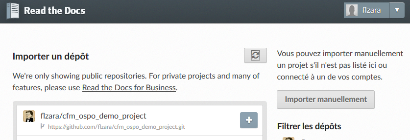
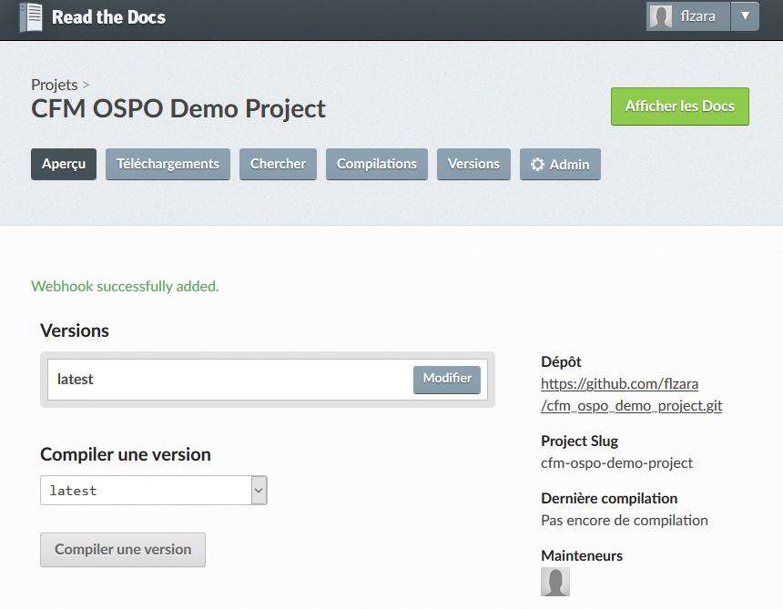
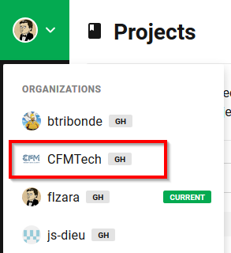
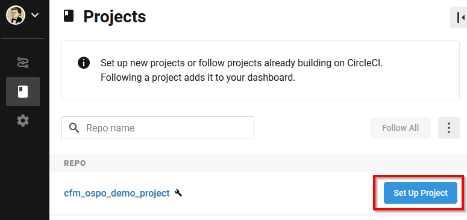
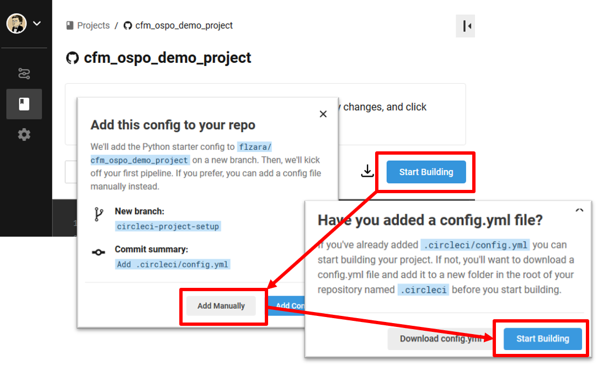
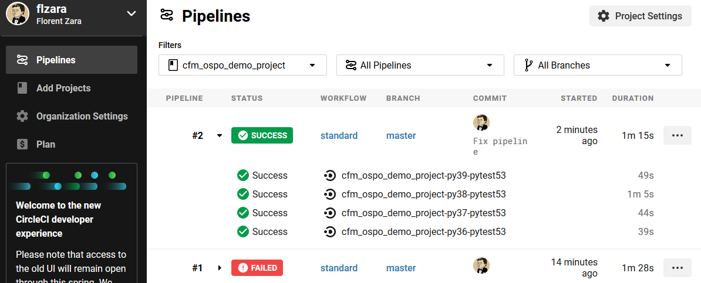
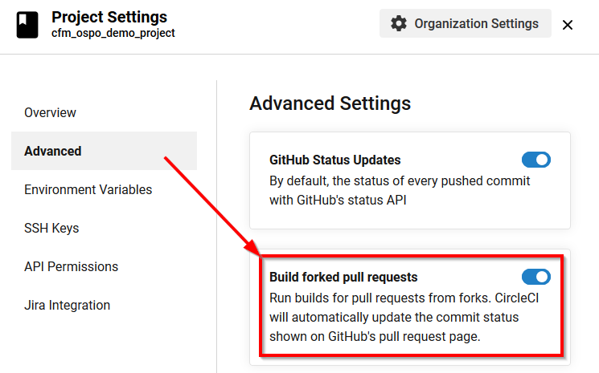

# Welcome to the CFM Open Source contribution Program

We will guide you through the necessary steps so that you can setup and build your Python project. We can generate for you a ready to be implemented project in Python featuring:
 * A sphinx based documentation template ready to build and publish on [Read The Docs]().
 * Pypi packaging
 * Github templates (PullRequest, Issues and Feature Request)
 * A [CircleCI](https://circleci.com/) workflow
 * Contribution guidelines
 * The MIT License file

## Prerequisites

You must have a Github account. Your git configuration must comply with the [SCM admins recos](https://confluence.fr.cfm.fr/display/ITPRF/GitLab+basics+-+Getting+started). If you are not sure about these, ask a member of SCM-Admin.

## Generate your project

To generate a project, type the following command:

```bash

 bash $> build_maintainer enable
 bash $> cookiecutter https://github.com/CFMTech/ospo.git
```

You will be prompted for several basic information, simply answer them. Please note that it will ask you for a `slug`. This is a short name given to your project to identify it. It's generally optimized for brevity or for consumption by search engines and other tools. We will generate one for you from your project name but you may change it.
Once done, a new folder will appear under the directory where you launched the commands.
The structure looks like the following:

```text
 * <root>
   |-- .github
   |-- docs
   |   |-- env.yaml
   |   |-- requirements.txt
   |   `-- sources
   |       |-- Makefile
   |       |-- make.bat
   |       |-- changelog.rst
   |       |-- conf.py
   |       |-- contributing.rst
   |       |-- index.rst
   |       |-- installation.rst
   |       `-- introduction.rst
   |-- <project>
   |   `-- __init__.py
   |-- .gitignore
   |-- .readthedocs.yml
   |-- AUTHORS
   |-- CONTRIBUTING.md
   |-- LICENSE
   |-- MANIFEST.in
   |-- README.md
   |-- requirements.txt
   `-- setup.py

```


## Building the documentation

A template documentation is generated and is ready to be built by 
**readthedocs**. Hereunder are described the required operations to build 
your documentation each time you push on the repository.

#### Log in to readthedocs.com

First, log in to https://readthedocs.org using your Github account.

#### Import your project

Go to **My Projects** -> **Import a Project**. You will need your repository to be public in order to import your project. If your project is still private, please contact an OSPO member before making it *public*.



#### Build your documentation

A webhook has automagically been added. From now on, each time you push commits on your repository, the documentation will be built!



#### Writing documentation

When writing your project documentation that it must follow this basic principles

1. Be user/reader centric
2. Be catchy
3. Be simple
4. Be informative
5. Be concrete

The format may be Markdown (.md) or ReSTructured text (.rst) as they are both recognized by Sphinx and ReadTheDocs

The README file contains sections we expect you to fill in thoroughly without any exception.

You may look at other CFM Open Source projects for detailed examples of what is expected: [Jupytab](https://github.com/CFMTech/Jupytab) and [Pytest-monitor](https://github.com/CFMTech/pytest-monitor).

## Building your project

To build your project in order to run your test suite, we will use [CircleCI](https://circleci.com) as our software factory.

#### Log in to circleci.com

First, log in to https://circleci.com using your Github account.

#### Import your project

Next, we will need to import your project. From your profile view, select the *CFMTech* organization. 


Once in CFMTech, click **Add Projects**. Select your project in the repository list by clicking *Set Up Project*




CircleCI will propose you a basic template. Ignore it as this template already provides a more complete one. To use it, successively click on *Start Building* then *Add Manually* and finally *Start Building* again. 



You're (nearly) done! CircleCI is now building your project and you'll be able to see progress and results on the *Pipelines* section.




Finally, we strongly recommend you that you activate the option *Build forked pull requests* located in the *Advanced* tab of your *Project Setting*. That way, every pull request you received will go through your pipeline before any merge. Results will be available directly in GitHub.



#### Extend your pipeline

The pipeline is described using Yaml and follow the following [syntax](https://circleci.com/docs/2.0/configuration-reference/).
Your pipeline is located in your repository under *.circleci/config.yaml*.  

## Code requirements

### License

By default your code will be under the MIT License which has been validated by the OSPO and legal department. A copy is provided with this template. 

Each code (or configuration, etc.) file should contain a standard SPDX license header (to be identified by tools that do automatic code analysis):

```
# SPDX-License-Identifier: MIT
# Copyright your-email@cfm.fr <year> Capital Fund Management
```

### Comments

The code must be documented (docstrings, in Python) and commented when needed according to good practices, considering the person who ends up maintaining your code is a violent psychopath who knows where you live.

1. Be simple: use high-level explanations
2. Be informative by documenting everything and being exhaustive
3. Be mindful of existing conventions (PEP257, PEP8)

### Testing

This template comes with a placeholder for your unit tests (We recommend [Pytest](https://www.pytest.org)). Abuse it: a minimum of 75% line coverage is required. A well tested code will help accepting external contributions

### CFM agnostic

Your code **must not contains**:

- CFM-specific code or dependencies.
- CFM "secrets": user names, machine names (including in URLs), secret keys or tokens, passwords, etc.


## Packaging and publication and PyPI

First packaging and publication on PyPI is done by the OSPO. Please [contact them](mailto:opensource@cfm.fr) for further information. Afterwards, you'll be able to do it on your own by means of a dedicated token.

## Packaging using Conda.

The packaging process requires interaction with the conda community and can be time consuming.
If you wish to package your project using conda, please open an issue at IT-Core. In this ticket,
please tell us:
  * whether your project is a noarch or if on the contrary targets a specific set of platforms.
  * if you have entry points, list them
  * what your project is about with a short description
  * your project's version
  * your project's requirements
  * any tests to validate your project

**NOTE** : All these informations are mandatory.

## Going public

When the project is in a first final state, the OSPO will make sure that it first goes through **Compliance** and **Security** before going public. First publication requires a version with no history (remove the .git ), given that the history might contain sensitive code or data (like internal CFM machine names), or sensitive review comments (that mention CFM's internal policies, etc.).

This may be hard to reconcile with the aforementioned tools (namely *Read The Docs* and *CircleCI* that requires public repositories to work out of the box). However the files in the templates should allow you to be up to speed in a few minutes once your project is public. Here's a simple process to do it without too many hassles:

1. Once ready, submit your private project on GitHub to Compliance & Security through the OPSO
2. When you have the Go for public, remove your .git directory
3. Switch your GitHub project to public
4. Check if *Read The Docs* and *CircleCI* are working fine and commit required fixes.
5. Once again, remove your .git directory and push back on the same repository
6. You may now communicate about your brand new Open Source project. 


## More information

For more detailed information on Open Sourcing a project at CFM, please read the [Contributor Guide for social media posts, blogs, open source, inner source](https://confluence.fr.cfm.fr/display/ITPRF/Contributor+Guide+(social+media+posts,+blogs,+open+source,+inner+source)) on Confluence.

For any questions regarding the Open Source governance and processes, please contact the [CFM Open Source Program Office](mailto:opensource@cfm.fr).

## Contributing

Contributions to this template are welcomed:

- Tests and usage reports (What works well, what doesn't work as expected)
- Bug reports
- Improvements and feature request
- Pull Request

Please [open an issue](https://github.com/js-dieu/cfm-template-python/issues/new) on this GitHub repository to discuss about any contribution. 

### Roadmap

- [ ] Code quality by providing an integration with [SonarCloud](https://sonarcloud.io/)
- [ ] Code coverage by providing and integration with [CodeCov](https://codecov.io/)
